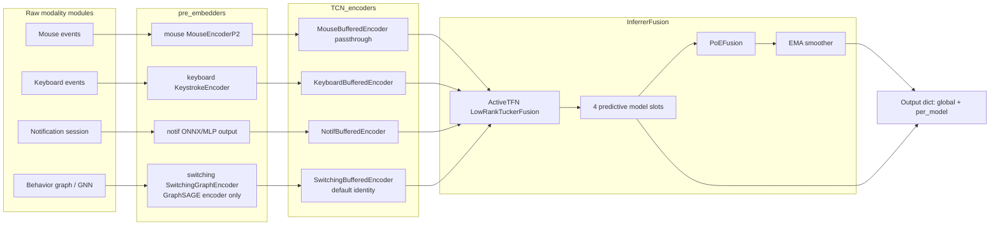
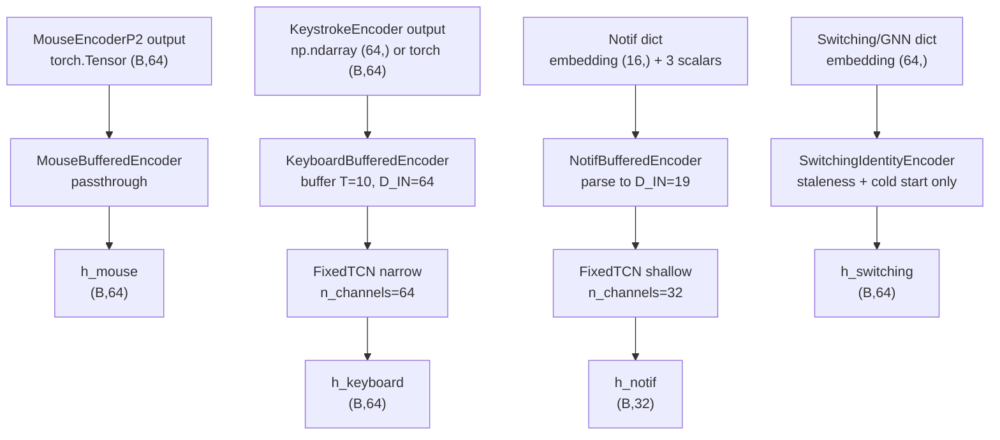
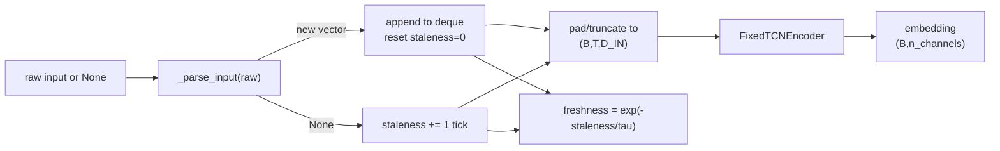
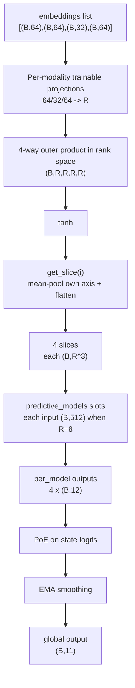
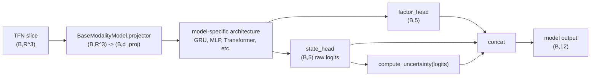
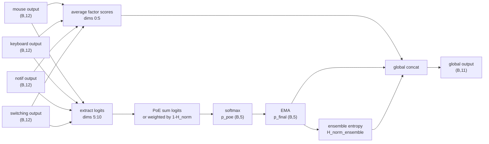
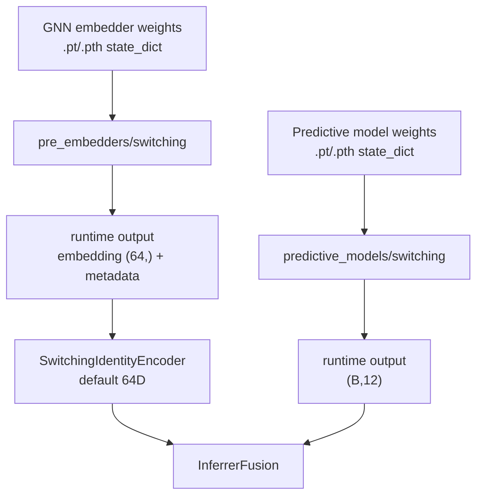

# Architecture du Fusion Model

Ce document decrit l'architecture complete du fusion model, le pipeline runtime,
et les contrats input/output de chaque composant.

Note d'etat du code: `fusion_model.py` utilise `ActiveTFN` depuis `TFN/__init__.py`,
donc l'implementation active par defaut est `LowRankTuckerFusion`.
`predictive_models/__init__.py` expose `MODALITY_MODELS` dans l'ordre
`mouse`, `keyboard`, `notif`, `switching`.

## Vue globale



## Pipeline runtime 1Hz

Le systeme tourne comme une boucle a 1Hz. A chaque tick, chaque encoder recoit
soit une nouvelle donnee, soit `None` si aucune mise a jour n'est arrivee.

```mermaid
sequenceDiagram
    participant Loop as 1Hz fusion loop
    participant Mouse as mouse_enc.step
    participant Keyboard as keyboard_enc.step
    participant Notif as notif_enc.step
    participant Switching as switching_enc.step
    participant Fusion as InferrerFusion.forward
    participant PoE as PoE + EMA

    Loop->>Mouse: m_t tensor, every tick
    Mouse-->>Loop: h_mouse (B,64), freshness 1.0

    Loop->>Keyboard: kb embedding or None
    Keyboard-->>Loop: h_keyboard (B,64), freshness

    Loop->>Notif: notif dict or None
    Notif-->>Loop: h_notif (B,32), freshness

    Loop->>Switching: switching dict or None
    Switching-->>Loop: h_switching (B,64), freshness

    Loop->>Fusion: [h_mouse, h_keyboard, h_notif, h_switching]
    Fusion->>Fusion: Tucker fusion and per-modality model slices
    Fusion->>PoE: per_model outputs, 4 x (B,12)
    PoE-->>Loop: global output (B,11)
```

## Modality input contracts



| Modality | Raw input to encoder | Parsed vector | Encoder output | Freshness |
| --- | --- | --- | --- | --- |
| mouse | `torch.Tensor` shape `(B,64)` | no parsing | `(B,64)` | always `1.0` |
| keyboard | `np.ndarray (64,)`, `torch.Tensor (64,)`, or `(B,64)` | `(64,)` per update | `(B,64)` | `exp(-staleness / 15.0)` |
| notif | dict with `embedding (16,)`, `npi`, `burstiness`, `disruption_score` | `(19,)` | `(B,32)` | `exp(-staleness / 10.0)` |
| switching | dict with `embedding (64,)` and optional metadata | `(64,)` | `(B,64)` | `exp(-staleness / 60.0)` |

## Switching / GNN encoder-only integration

Le slot switching est integre via `pre_embedders/switching/encoder.py`.
Ce wrapper charge `exports/switching_encoder/encoder.pt` une seule fois au
startup, puis appelle l'API exportee pour chaque fenetre graphe de 120 secondes:

```python
from pre_embedders.switching import load_model

switching_session = load_model(
    export_dir="pre_embedders/switching/exports/switching_encoder",
    device="auto",
)

switching_payload = switching_session.get_fusion_input(graph_json_or_path)
switching_emb, switching_freshness = switching_enc.step(switching_payload)
```

Pipeline attendu:

```mermaid
flowchart LR
    G["graph_json_or_path"] --> OUTPY["switching_encoder/output.py"]
    OUTPY --> SAGE["GraphSAGE encoder only"]
    SAGE --> POOL["global_mean_pool"]
    POOL --> L2["L2 normalization"]
    L2 --> EMB["np.ndarray<br/>(64,) float32"]
    EMB --> WRAP["SwitchingGraphEncoder<br/>metadata preserved"]
    WRAP --> BUF["SwitchingIdentityEncoder"]
    BUF --> FUS["fusion switching modality<br/>(B,64)"]
```



Le decoder GAE n'est pas charge, appele, ni utilise pendant la fusion.
Le GNN ne fait pas de prediction cognitive; il fournit uniquement l'embedding
graphe.

La sortie exportee ressemble a:

```python
{
    "embedding": np.ndarray(shape=(64,), dtype=np.float32),
    "metadata": {
        "module": "switching",
        "encoder": "GraphSAGE_GAE",
        "embedding_dim": 64,
        "window_size_s": 120,
        "normalized": "l2",
        "cold_start": False,
        "decoder_used_at_inference": False,
    },
}
```

Cold start:

```python
{
    "embedding": np.zeros(64, dtype=np.float32),
    "metadata": {
        "module": "switching",
        "cold_start": True,
        "reason": "empty_or_invalid_graph",
    },
}
```

`SwitchingBufferedEncoder` est une factory compatible avec le mode actif. Par
defaut, `SWITCHING_ENCODER_MODE=identity`, donc l'embedding GraphSAGE 64D est
retourne tel quel.

Le chemin random-frozen TCN reste disponible seulement en ablation:

```python
from TCN_encoders.switching.encoder import SwitchingRandomFrozenTCNEncoder

switching_enc = SwitchingRandomFrozenTCNEncoder()
```

ou via `SWITCHING_ENCODER_MODE=random_frozen_tcn`.

Les metadata switching sont gardees dans `SwitchingGraphEncoder.last_metadata`
et dans `SwitchingBufferedEncoder.debug_state()`. Le helper
`attach_switching_debug(...)` peut les ajouter au dict de sortie fusion sous
`output["debug"]["switching"]`.

## BufferedEncoder behavior

`KeyboardBufferedEncoder` et `NotifBufferedEncoder` partagent le comportement
general via `BufferedEncoder`. Le switching par defaut utilise
`SwitchingIdentityEncoder`: il garde le dernier embedding valide, gere le cold
start et calcule la freshness, sans appliquer de TCN.



The `FixedTCNEncoder` weights are initialized once and frozen. It remains used
by keyboard/notif and by the switching random-frozen ablation, but not by the
default switching identity path.

## Fusion core

Default construction:

```python
InferrerFusion(
    d_dims=[64, 64, 32, 64],
    rank=8,
    d_proj=256,
    poe_mode="vanilla",
    ema_alpha=0.7,
)
```



With default `rank=8`, each model receives `R^3 = 512` features.
If `rank=4`, each model receives `64` features. If `rank=16`, each model
receives `4096` features.

## Predictive model contract

Each active model in `predictive_models/{modality}/` must subclass
`BaseModalityModel`.



Output layout for each predictive model:

| Dim range | Meaning | Shape |
| --- | --- | --- |
| `0:5` | continuous factors `[mental_demand, temporal_demand, effort, frustration, arousal]` | `(B,5)` |
| `5:10` | raw state logits `[Flow, Neutral, Bored, Distracted, Overloaded]` | `(B,5)` |
| `10` | normalized entropy `H_norm` from `compute_uncertainty` | `(B,)` |
| `11` | margin confidence `M` from `compute_uncertainty` | `(B,)` |

Important: dims `5:10` must be raw logits. Do not apply softmax inside the
predictive model. `PoEFusion` applies softmax after combining experts.

## PoE and EMA outputs



Global output layout:

| Dim range | Meaning | Shape |
| --- | --- | --- |
| `0:5` | averaged continuous factors | `(B,5)` |
| `5:10` | final EMA-smoothed state probabilities | `(B,5)` |
| `10` | ensemble normalized entropy | `(B,)` |

Full return value:

```python
{
    "global": torch.Tensor,      # shape (B,11)
    "per_model": [               # length 4
        torch.Tensor,            # mouse, shape (B,12)
        torch.Tensor,            # keyboard, shape (B,12)
        torch.Tensor,            # notif, shape (B,12)
        torch.Tensor,            # switching, shape (B,12)
    ],
}
```

## Training and weights placement



Use `pre_embedders/switching/` for a GNN that creates embeddings from graphs.
Use `predictive_models/switching/` only for the model that receives the TFN
slice and predicts factors plus state logits.
