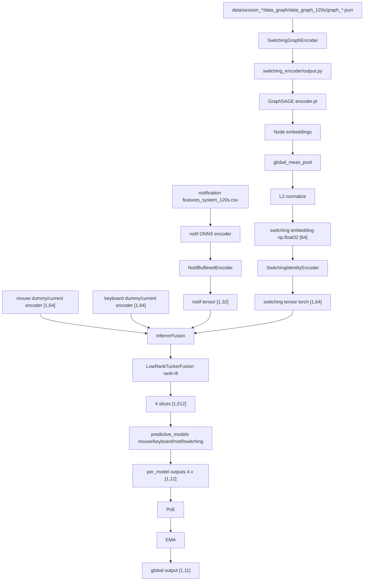

# Rapport integration Fusion + GNN Switching

Date: 2026-06-01

Ce rapport resume les changements des 6 derniers commits et explique le
fonctionnement actuel du pipeline: lecture des graphes 120s, passage dans le
GNN GraphSAGE exporte, integration dans le modele de fusion, sorties debug, et
commandes de test.

## 1. Resume executif

Le projet a maintenant un chemin switching principal base sur le GNN exporte:

```text
graph JSON 120s
  -> pre_embedders/switching/exports/switching_encoder/output.py
  -> GraphSAGE encoder only
  -> global_mean_pool
  -> L2 normalization
  -> embedding switching np.ndarray [64], float32
  -> SwitchingIdentityEncoder
  -> tensor torch [1,64]
  -> LowRankTuckerFusion
  -> switching TFN slice [1,512]
  -> predictive_models/switching/SwitchingGRU
  -> output switching [1,12]
```

Points importants:

- Le GNN n'est pas re-entraine dans ce projet.
- Les poids `encoder.pt` ne sont pas modifies.
- Le decoder GAE n'est pas utilise en inference.
- Le chemin actif switching est `identity`, donc il garde le vecteur GraphSAGE
  64D.
- L'ancien chemin `random_frozen_tcn` reste disponible seulement pour ablation.
- Le modele predictif switching actif est maintenant `SwitchingGRU`.
- `mouse` et `keyboard` sont encore des chemins baseline/dummy dans les runners
  smoke tant que leurs vrais embedders ne sont pas branches.
- `notif` utilise le modele ONNX quand `onnxruntime` est installe.

## 2. Derniers commits concernes

### `0bdf5e8` - Use 64D identity path for switching GraphSAGE embeddings

Changements principaux:

- Ajout du package exporte du GNN switching:
  - `pre_embedders/switching/exports/switching_encoder/encoder.pt`
  - `output.py`
  - `feature_spec.json`
  - `model_config.json`
  - `embedding_contract.json`
  - `test_export.py`
- Ajout du wrapper fusion:
  - `pre_embedders/switching/encoder.py`
  - `pre_embedders/switching/__init__.py`
- Modification du switching encoder cote fusion:
  - `TCN_encoders/switching/encoder.py`
  - `TCN_encoders/switching/__init__.py`
- Passage du switching de 32D random-frozen vers 64D identity par defaut.
- Mise a jour de `fusion_model.py` avec:

```python
DEFAULT_D_DIMS = [64, 64, 32, 64]
```

- Ajout de tests d'integration:
  - `tests/test_switching_encoder_integration.py`

### `ff90f53` - Wire fusion model with baseline modality predictors

Changements principaux:

- Ajout du registre actif des predictive models:
  - `predictive_models/__init__.py`
- Ajout d'un baseline MLP commun:
  - `predictive_models/baseline.py`
- Ajout des baselines:
  - `predictive_models/mouse/v0_baseline.py`
  - `predictive_models/keyboard/v0_baseline.py`
  - `predictive_models/switching/v0_baseline.py`
- Activation du `NotifGRU` deja present pour la modalite notification.
- Ajout de `test_fusion.py` pour verifier le wiring complet.

### `de4ebf5` - run_switching_fusion_smoke

Changements principaux:

- Ajout de `run_switching_fusion_smoke.py`.
- Ce script lance une inference sur un seul graphe:
  - charge le GNN switching une seule fois;
  - extrait le vrai embedding switching;
  - construit des embeddings dummy pour mouse/keyboard/notif;
  - appelle `InferrerFusion`;
  - affiche les shapes, metadata et debug.

### `9b81cad` - Add multi-window fusion smoke runner for switching graphs

Changements principaux:

- Ajout de `run_fusion_session_smoke.py`.
- Le script parcourt tous les graphes 120s d'une session:

```text
data/<session>/data_graph/data_graph_120s/graph_*.json
```

- Il produit un fichier JSONL:

```text
outputs/fusion_smoke/<session_id>/fusion_outputs.jsonl
```

- Ajout de `data/` et `outputs/` dans `.gitignore`.

### `741a79c` - Confirm identity switching path in fusion smoke pipeline

Changements principaux:

- Enrichissement de `run_fusion_session_smoke.py`.
- Ajout du support notification:
  - lecture de `features/system/features_system_120s.csv`;
  - alignement par `window_id`;
  - utilisation de `pre_embedders/notif/models/notif_mlp.onnx` si disponible;
  - fallback zero embedding si ONNX/onnxruntime n'est pas disponible.
- Ajout de metadata debug dans le JSONL:
  - `graph_id`
  - `session_id`
  - `window_id`
  - `cold_start`
  - `decoder_used_at_inference`
  - `switching.tensor_shape`
  - `switching.embedding_shape`
  - `notif.embedding_source`

### `bba47eb` - prototype of predicitive_model for switching

Changements principaux:

- Ajout de:

```text
predictive_models/switching/v1_switching_gru.py
```

- Activation de `SwitchingGRU` comme modele predictif switching actif:

```python
from .v1_switching_gru import SwitchingGRU as ActiveModel
```

- Ajout de tests pour verifier:
  - que `SwitchingGRU` est bien le `ActiveModel`;
  - que son output est `[B,12]`;
  - que `reset_microstate()` fonctionne.

## 3. Architecture actuelle



## 4. Comment le GNN est utilise

Le GNN utilise en fusion est uniquement l'encodeur GraphSAGE exporte.

Fichiers importants:

```text
pre_embedders/switching/exports/switching_encoder/encoder.pt
pre_embedders/switching/exports/switching_encoder/output.py
pre_embedders/switching/exports/switching_encoder/model_config.json
pre_embedders/switching/exports/switching_encoder/feature_spec.json
pre_embedders/switching/exports/switching_encoder/embedding_contract.json
```

Le contrat declare:

```json
{
  "module": "switching",
  "encoder": "GraphSAGE_GAE",
  "embedding_dim": 64,
  "dtype": "float32",
  "normalization": "l2",
  "update_frequency_s": 120,
  "decoder_used_at_inference": false
}
```

Le fichier `model_config.json` indique aussi:

```json
{
  "encoder_type": "GraphSAGE",
  "training_type": "GAE",
  "decoder_used_for_training": "directed",
  "decoder_used_at_inference": false,
  "embedding_dim": 64,
  "input_dim": 169,
  "edge_attr_dim": 17,
  "use_edge_attr": true,
  "window_size_s": 120
}
```

Donc:

- Le decoder a servi a l'entrainement GAE dans l'autre projet.
- Le decoder n'est pas charge dans le pipeline fusion.
- Le fichier `encoder.pt` contient les poids de l'encodeur.
- Les poids sont charges avec PyTorch et mis en `eval()`.
- Pour chaque graphe 120s, `get_output(session, graph_path)` retourne un
  embedding global du graphe.

## 5. Comment les donnees sont passees au GNN

Les donnees switching sont des fichiers JSON de graphe, par exemple:

```text
data/session_20260516_105702_81c740/data_graph/data_graph_120s/graph_001.json
```

Le script `run_fusion_session_smoke.py` cherche les graphes avec:

```text
**/data_graph_120s/graph_*.json
**/switching/data_graph_120s/graph_*.json
```

Pour chaque fichier:

1. Le chemin du graphe est donne au wrapper:

```python
switching_payload = switching_session.get_fusion_input(graph_path)
```

2. Le wrapper appelle l'API exportee:

```python
result = output.get_output(session, graph_path)
```

3. `output.py` charge le JSON et convertit le graphe en objet PyTorch
   Geometric `Data`.

Format attendu du JSON:

```text
{
  "graph_id": "...",
  "session_id": "...",
  "window": {
    "window_id": "..."
  },
  "nodes": [
    {
      "id": "...",
      "features": {
        "...": "..."
      }
    }
  ],
  "edges": [
    {
      "source": "...",
      "target": "...",
      "weight": 1.0,
      "features": {
        "...": "..."
      }
    }
  ]
}
```

Les features sont interpretees avec `feature_spec.json`:

- features numeriques des noeuds;
- features categorielles des noeuds;
- features numeriques des edges;
- features categorielles des edges;
- normalisation z-score pour les numeriques;
- hashing stable pour les categories;
- edge weight par defaut `1.0` si absent.

Dimensions internes du graphe:

```text
node features: 169
edge features: 17
```

Ensuite:

```text
JSON graph
  -> graph_payload_to_data
  -> Data(x, edge_index, edge_attr)
  -> GraphSAGE encoder
  -> z_node
  -> global_mean_pool(z_node)
  -> z_graph [64]
  -> L2 normalization
  -> np.ndarray [64], dtype float32
```

Si le graphe est vide ou invalide:

```text
embedding = zeros(64), float32
metadata.cold_start = true
metadata.reason = "empty_or_invalid_graph"
```

## 6. Role de `SwitchingGraphEncoder`

Le fichier `pre_embedders/switching/encoder.py` sert de facade propre entre le
projet fusion et le package exporte du GNN.

Il fait 4 choses:

1. Charge dynamiquement `exports/switching_encoder/output.py`.
2. Appelle `load_model(...)` une seule fois au startup.
3. Appelle `get_output(session, graph_json_or_path)` a chaque fenetre 120s.
4. Valide le contrat:

```text
shape == (64,)
dtype == np.float32
no NaN / no Inf
L2 norm ~= 1.0 si cold_start == false
decoder_used_at_inference == false
```

Sortie typique:

```python
{
    "embedding": np.ndarray shape (64,), dtype np.float32,
    "metadata": {
        "module": "switching",
        "encoder": "GraphSAGE_GAE",
        "embedding_dim": 64,
        "window_size_s": 120,
        "normalized": "l2",
        "graph_id": "...",
        "session_id": "...",
        "window_id": "...",
        "cold_start": False,
        "decoder_used_at_inference": False
    }
}
```

## 7. Pourquoi `identity-only` et pas `random-frozen`

Le GNN GraphSAGE produit deja un embedding appris et global du graphe 120s.
Donc le chemin principal conserve directement cet embedding:

```text
GraphSAGE output [64] -> SwitchingIdentityEncoder -> torch [1,64]
```

L'ancien chemin random-frozen faisait:

```text
GraphSAGE output [64] + metrics -> random frozen TCN -> [1,32]
```

Ce chemin est garde seulement pour ablation:

```python
SwitchingBufferedEncoder(mode="random_frozen_tcn")
```

Le mode par defaut reste:

```text
identity
```

La validation runtime a confirme:

```text
switching.embedding_shape = [64]
switching.tensor_shape    = [1,64]
```

Donc l'ancien chemin `[1,32]` n'est pas actif dans le main path.

## 8. Fonctionnement de la fusion

`InferrerFusion` recoit une liste de 4 embeddings:

```python
[
    h_mouse,      # [B,64]
    h_keyboard,   # [B,64]
    h_notif,      # [B,32]
    h_switching,  # [B,64]
]
```

Les dimensions par defaut sont:

```python
DEFAULT_D_DIMS = [64, 64, 32, 64]
```

La fusion active est `LowRankTuckerFusion` avec `rank=8`.

Chaque modalite est projetee vers 8:

```text
mouse      [64] -> [8]
keyboard   [64] -> [8]
notif      [32] -> [8]
switching  [64] -> [8]
```

Puis Tucker construit un tenseur:

```text
[B, 8, 8, 8, 8]
```

Chaque predictive model recoit une slice:

```text
8 * 8 * 8 = 512
```

Donc:

```text
input de chaque predictive_model = [B,512]
```

Ce `512` ne vient pas du GNN. Il vient du Tucker:

```text
512 = rank^3 = 8^3
```

## 9. Predictive models actifs

Le registre est dans:

```text
predictive_models/__init__.py
```

Ordre obligatoire:

```text
mouse, keyboard, notif, switching
```

Etat actuel:

```text
mouse      -> MouseBaselineModel
keyboard   -> KeyboardBaselineModel
notif      -> NotifGRU
switching  -> SwitchingGRU
```

Le nouveau `SwitchingGRU` recoit:

```text
input  : [B,512]
output : [B,12]
```

Son output respecte le contrat commun:

```text
dims 0-4   : facteurs cognitifs
dims 5-9   : logits d'etat
dim 10     : H_norm
dim 11     : M
```

Important:

- `SwitchingGRU` est branche dans le pipeline.
- Ses poids ne sont pas encore entraines.
- L'etape suivante sera d'entrainer `LowRankTuckerFusion + predictive_models`
  ensemble sur les fenetres labellisees.

## 10. Sorties debug et JSONL

Le runner multi-window ecrit:

```text
outputs/fusion_smoke/<session_id>/fusion_outputs.jsonl
```

Chaque ligne correspond a une fenetre 120s.

Champs importants:

```text
window_index
window_id
graph_id
session_id
switching.embedding_shape
switching.embedding_dtype
switching.embedding_l2_norm
switching.tensor_shape
switching.metadata
switching.debug_state
notif.embedding_shape
notif.tensor_shape
notif.metadata.embedding_source
fusion.global_shape
fusion.per_model_shapes
```

Validation recente:

```text
num_windows = 8
cold_starts = 0
switching.embedding_shape = [64]
switching.tensor_shape = [1,64]
embedding_norm_min ~= 0.99999988
embedding_norm_max = 1.0
notif_onnx_status = onnx
```

Cela confirme:

```text
GraphSAGE encoder -> identity switching [1,64] -> fusion
```

## 11. Comment lancer les tests

Depuis la racine du projet:

```powershell
cd C:\Users\medte\OneDrive\Desktop\Fusion_Model
```

### Tests unitaires fusion

```powershell
python test_fusion.py
```

Attendu:

```text
Ran 7 tests
OK
```

Ce test verifie notamment:

- dimensions par defaut `[64,64,32,64]`;
- registre de 4 predictive models;
- `SwitchingGRU` comme modele switching actif;
- output global `[B,11]`;
- outputs per-model `[B,12]`;
- reset microstate.

### Tests integration switching/GNN

```powershell
python -m unittest tests.test_switching_encoder_integration
```

Attendu:

```text
Ran 8 tests
OK
```

Ce test verifie notamment:

- contrat export GraphSAGE;
- cold start;
- shape `(64,)`;
- dtype `float32`;
- pas de NaN/Inf;
- L2 norm;
- `decoder_used_at_inference=False`;
- identity encoder `[1,64]`;
- ablation random-frozen encore disponible `[1,32]`;
- Tucker slice `[1,512]`.

### Smoke test sur un seul graphe

```powershell
python scripts\fusion\run_switching_fusion_smoke.py --graph data\session_20260516_105702_81c740\data_graph\data_graph_120s\graph_001.json
```

Ou auto-detection du premier graphe sous `data/`:

```powershell
python scripts\fusion\run_switching_fusion_smoke.py
```

Champs a verifier:

```text
switching_embedding_shape = [64]
switching_embedding_dtype = float32
switching_embedding_l2_norm ~= 1.0
switching_tensor_shape = [1,64]
fusion_global_shape = [1,11]
fusion_per_model_shapes = [[1,12], [1,12], [1,12], [1,12]]
```

### Smoke test sur une session complete

```powershell
python scripts\fusion\run_fusion_session_smoke.py --session-dir data\session_20260516_105702_81c740
```

Limiter a 2 fenetres:

```powershell
python scripts\fusion\run_fusion_session_smoke.py --session-dir data\session_20260516_105702_81c740 --limit 2
```

Choisir un fichier output:

```powershell
python scripts\fusion\run_fusion_session_smoke.py --session-dir data\session_20260516_105702_81c740 --limit 2 --output outputs\fusion_smoke\session_20260516_105702_81c740\fusion_outputs_check.jsonl
```

Attendu dans le resume:

```text
cold_starts = 0
embedding_norm_min ~= 1.0
embedding_norm_max ~= 1.0
notif_onnx_status = onnx
notif_windows_matched > 0
num_windows = nombre de graph_*.json traites
```

### Verifier les shapes dans le JSONL

```powershell
$path = 'outputs\fusion_smoke\session_20260516_105702_81c740\fusion_outputs.jsonl'
Get-Content $path |
  ForEach-Object { $_ | ConvertFrom-Json } |
  Select-Object window_index,window_id,graph_id,
    @{Name='embedding_shape';Expression={'[' + ($_.switching.embedding_shape -join ',') + ']'}},
    @{Name='tensor_shape';Expression={'[' + ($_.switching.tensor_shape -join ',') + ']'}},
    @{Name='cold_start';Expression={$_.switching.metadata.cold_start}} |
  Format-Table -AutoSize
```

Attendu:

```text
embedding_shape = [64]
tensor_shape    = [1,64]
cold_start      = False
```

## 12. Installation dependance notification ONNX

Si `notif_onnx_status` vaut `onnxruntime_missing`, installer:

```powershell
python -m pip install onnxruntime
```

Verifier:

```powershell
python -c "import onnxruntime as ort; print(ort.__version__)"
```

Apres installation, `run_fusion_session_smoke.py` doit afficher:

```text
notif_onnx_status = onnx
```

et dans le JSONL:

```text
notif.metadata.embedding_source = onnx
```

## 13. Ce qui reste a faire

Le pipeline runtime est maintenant branche, mais il n'est pas encore un modele
final entraine de bout en bout.

Prochaines etapes recommandees:

1. Brancher les vrais embedders/features `keyboard` et `mouse`.
2. Construire un dataset de fenetres:

```text
mouse_embedding [64]
keyboard_embedding [64]
notif_embedding [32]
switching_embedding [64]
label cognitif / facteurs / etat
```

3. Entrainer ensemble:

```text
LowRankTuckerFusion + predictive_models
```

4. Garder frozen:

```text
GraphSAGE switching encoder
notif ONNX encoder
mouse/keyboard embedders s'ils sont deja pre-entraines
```

5. Sauvegarder les poids entraines des predictive models et de Tucker.

## 14. Conclusion

Le GNN est maintenant integre comme un sous-module propre du pipeline fusion:

- input: graphe JSON 120s;
- traitement: GraphSAGE encoder exporte, encoder-only;
- pooling: `global_mean_pool`;
- output: embedding switching `[64]`, `float32`, L2-normalise;
- integration: `SwitchingIdentityEncoder` vers tensor `[1,64]`;
- fusion: Tucker rank 8;
- prediction: `SwitchingGRU` sur slice `[1,512]`.

Le point le plus important est confirme:

```text
switching.tensor_shape = [1,64]
```

Donc le main path utilise bien l'integration identity-only du GNN, et pas
l'ancien chemin random-frozen `[1,32]`.
